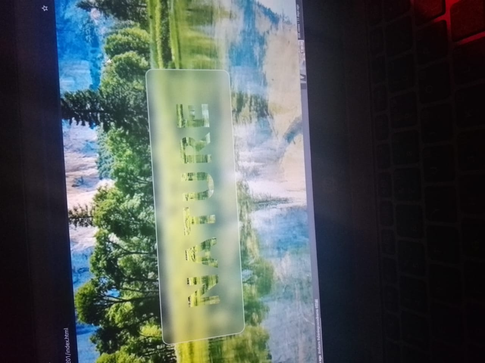

# 🌸 Day 1 — Transparent Effect

Today I created a **transparent background effect** using **CSS**!  
It looks like glass and shines beautifully ✨

---

## 🪄 What I Learned
- How to use `backdrop-filter`
- How to make elements look like frosted glass
- How to make fun color gradients!

---

## 🖼
 Preview

---

## 🧠 Next Idea
Something fun with animations maybe 👀💫
